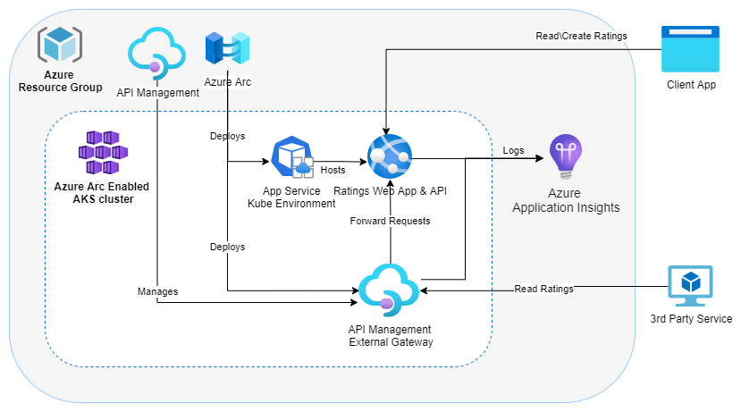

# App Service and API Management on Arc-enabled Kubernetes sample

## Introduction

The aim of this project is to illustrate a simple Azure App Service example running on an ARC-enabled Kubernetes cluster, with APIs exposed using an external API Management Gateway in the Kubernetes cluster.
This Web App allows user to read and create a rating of a product. It is a single web page that calls APIs hosted by the server component. When deployed to Azure, the API Management Gateway exposes some of the APIs from within the cluster.



Background reading:

* [App Service, Functions, and Logic Apps on Azure Arc (Preview)](https://docs.microsoft.com/en-US/Azure/app-service/overview-arc-integration)
* [Deploy an Azure API Management gateway on Azure Arc (preview)](https://docs.microsoft.com/en-us/azure/api-management/how-to-deploy-self-hosted-gateway-azure-arc)

## Local Build and Test

### Visual Studio

1. Open `Ratings.sln` in Visual Studio.
1. Press `f5` to debug Ratings.Server project.
1. A browser should open at the url `https://localhost:44344/`

### Visual Studio Code

1. Open the folder you cloned in VS Code.
1. Re-open the window in a dev container. You'll need Docker and the [Remote Development Extension](https://marketplace.visualstudio.com/items?itemName=ms-vscode-remote.vscode-remote-extensionpack) installed. This container has all the tools and cli extensions you'll need preinstalled. If you can't open the dev container, check ./devcontainer/Dockerfile for the prerequisites.
1. Press f5 - you may ignore any warnings or errors regarding the webasm debugging extension if you already have it installed.
1. Open a browser at the url `https://locahost:5000`

Follow the on screen instructions to add or view ratings.

### Postman

1. Install Postman and open it.
1. Disable SSL certificate verification: From File > Settings (General tab), disable SSL certificate verification. (Please remember to re-enable SSL certificate verification after testing the api.)
1. Send new GET request to `https://localhost:44344/ratings`
1. Check that the result returns all existing ratings in a memory.
1. Perform a GET request for a specific rating by changing the URI to `https://localhost:44344/ratings/book`.
1. Create a new rating by doing a POST request to `https://localhost:44344/ratings` using the following body (with `Content-Type` set to `application/json`):

    ```json
    {
        "id":"ice_cream",
        "rating":5,
        "userNotes":"Good choice"
    }
    ```

### Swagger

1. Open the Swagger endpoint by doing one of the following:
    1. Run the app in either Visual Studio or Visual Studio Code, and navigate to the '/swagger' endpoint in your browser or click on the Swagger link in the top right corner of any page.
    1. Open the app in Visual Studio, set Debug Profile to Swagger, and press `f5`
1. Follow the instructions on the Swagger interface to test GET requests.
1. Create a new rating by doing a POST request using the following body:

    ```json
    {
        "id":"ice_cream",
        "rating":5,
        "userNotes":"Good choice"
    }
    ```

## Deploy to Azure

### Prepare environment

1. Open the folder you cloned in VS Code.
1. Re-open the window in a dev container. You'll need Docker and the [Remote Development Extension](https://marketplace.visualstudio.com/items?itemName=ms-vscode-remote.vscode-remote-extensionpack) installed. This container has all the tools and cli extensions you'll need preinstalled. If you can't open the dev container, check ./devcontainer/Dockerfile for the prerequisites.
    > [!TIP]
    > Windows users may face an error while opening the dev container due to Windows style newline characters being added that are not recognized by the bash script from the dev container while cloning the repo. To fix this run 'git config --global core.autocrlf input' in the admin mode. You can find more information [here](https://www.git-scm.com/book/en/v2/Customizing-Git-Git-Configuration).
    >
    > [!TIP]
    > If using WSL1 or Docker *without* the WSL backend:
    >
    > 1. Make sure that Docker setting 'Expose daemon on tcp://localhost:2375 without TLS' is enabled, so the docker daemon is running in the container.
    > 2. Uncomment the line `# ENV DOCKER_HOST=tcp://host.docker.internal:2375` in the `./.devcontainer/Dockerfile`.
    > 3. Comment out the `mounts` section in teh `./.devcontainer/devcontainer.json` file.

1. Open the integrated PowerShell 7 terminal (pwsh)
1. Log into your Azure subscription using 'az login'.
1. Ensure you are in the `/env` directory.
1. To enable the necessary resource providers in your subscription run

    ```bash
    ./deployFeatureRegister.ps1
    ```

1. Update the basename variable of the deployment in the file `setVariables.ps1` and run it.

    > [!TIP]
    > Avoid special characters in your namings, as some of the commands support only numbers, characters, '.' and '-'.

    ```powershell
    ./setVariables.ps1
    ```

1. Create a compliant AKS cluster, an Azure Container Registry instance, an Application Insights Monitoring resource, a public static IP address and connect the cluster to Arc

    ```powershell
    ./provisionBaseInfra.ps1
    ```

### Provision Web App

1. Provision your App Service Environment into your Kubernetes cluster

    ```powershell
    ./provisionAppServiceInfra.ps1
    ```

1. Build and deploy the Web app from an image stored in the Azure Container Registry into the App Service Kube Environment

    > [!NOTE]
    > The argument `v1` is used for the build id of the image - you can override this with any value.

    ```powershell
    ./deployAppService.ps1 v1
    ```

    The script will output the url of your deployed website.

### Provision API Management

Provision an API Management instance in Azure, and a self hosted gateway in your Kubernetes cluster.
> [!NOTE]
> It may take up to 40 minutes to create an API Management service instance. It is safe to rerun the script in case of a timeout.

```powershell
./deployAPIM.ps1
```

The script will output the Azure Portal url of the gateway, and the url of the deployed api

### Test API Management in Azure

The gateway is deployed as a LoadBalancer Kubernetes service. We can make requests to the external ip and port exposed by the service.

```powershell
# view the service details
kubectl get services -n ${apimNamespace}

# make api request
Write-Host $(Invoke-WebRequest -Uri $apiUrl).Content
```

You can also view the logs of the pod hosting the gateway - this is useful when troubleshooting a service that won't accept connections.

```powershell
$podName = kubectl get pods -n ${apimNamespace} -o name
kubectl logs $podName -n ${apimNamespace}  
```

## Resources

* [App Service, Functions, and Logic Apps on Azure Arc (Preview)](https://docs.microsoft.com/en-US/Azure/app-service/overview-arc-integration)
* [Set up an Azure Arc enabled Kubernetes cluster to run App Service, Functions, and Logic Apps (Preview)](https://docs.microsoft.com/en-us/azure/app-service/manage-create-arc-environment)
* [Deploy an Azure API Management gateway on Azure Arc (preview)](https://docs.microsoft.com/en-us/azure/api-management/how-to-deploy-self-hosted-gateway-azure-arc)
* [Cluster extensions on Azure Arc-enabled Kubernetes](https://docs.microsoft.com/en-us/azure/azure-arc/kubernetes/conceptual-extensions)
* [Deploy and manage Azure Arc-enabled Kubernetes cluster extensions](https://docs.microsoft.com/en-us/azure/azure-arc/kubernetes/extensions)
* [Programmatically generate access tokens for gateways](https://docs.microsoft.com/en-us/rest/api/apimanagement/2019-12-01/gateway/generate-token)
